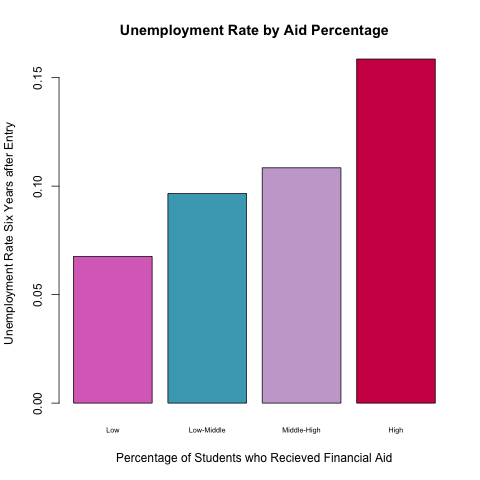

## Introduction 

Statistical Analysis to determine if public spending improves the quality of education.

Assumption: Examing a college based on post educational undemployment rate can be used as an effective metric for postgrad success of institutions


Models used to estimate effect of spending on education:

1. Hypothesis Tests
2. Lasso
3. Ridge
4. PCR

## Hypothesis Tests -- Data

Independent Variable : The Amount of Funding a School Recieved 
    
  $$P_f = \frac{\sum_{} (P_i * N_i)}{N_s} $$
  
$P_f$ : Percent of students recieving financial aid 

$P_i$ : Percentage of aided students whose family income is between x-y 

$N_i$ : Number of students in that category

$N_s$ : Total number of students
    

## Hypothesis Testing -- Data

Response Variable : Unemployment Rate

  $$ U = \frac{S_N}{S_N + S_W} $$

$S_N$ : Number of Students Not Working and not enrolled six years after entry 

$S_W$ : Number of Students working and not enrolled six years after entry


## Hypothesis Testing -- Method

Data was split into four groups:
  Schools that recieved relatively low, low-middle, middle-high, and a high amount of funding
  
If the amount of funding recieved by the school has no effect on quality of education rate, we should see little difference in the response variable (unemployment rate), and that difference is solely due to chance.


## Hypothesis Testing -- Method

$$\frac{(u_1 + u_2)}{2} = \frac{(u_3 + u_4)}{2}$$

$u_1$ = mean of unemployment rate for school with low funding

$u_2$ = mean of unemployment rate for school with low-mid funding

$u_3$ = mean of unemployment rate for school with mid-high funding

$u_3$ = mean of unemployment rate for school with high funding

Estimate of Effect of Spending is $y_i = (u_1 + u_2) - (u_3 + u_4)$. The vector of coefficients for this model is $W(u) = (0.5, 0.5, -0.5, -0.5)$.


$$ error = \sigma^2 * \sum{} (\frac{w_i^2}{n_i}) $$

$\sigma^2$ : overall variance

$w_i$ : coefficent for group

$n_i$ : number of observations in the group

## Hypothesis Testing -- Results

<div class="columns-2">




<div>

<div>

```{r, echo = FALSE, include = FALSE}
load("../data/hyp_results.RData")
```

Estimate for effect of spending : `r estimate`

Standard error of the estimate : `r sqrt(varx)`

</div>

## Modeling -- Data

1. Make all factors numeric variables
2. Remove all columns with greater than 50% missing data
3. Mean centered and standardized data

## Modeling -- Method

Ridge & Lasso were the two shrinkage modelling methods used. When using shrinkage methods the goal is to penalize certain parameters that should have a less significant effect on the model.

For Ridge, the cofficients that minimize the following equation are determined:

$$ \sum_{i=1}^{n}(y_i-\beta_0-\sum_{j=1}^{p}\beta_jx_{ij}) + \lambda\sum_{j=1}^{p}\beta_{j}^{2} $$

For lambda, the same equation is used but $\beta$ is not squared.

PCR is the dimension reduction modelling methods we used.  This method labors under the assumption that a subset of all of the predictor variables account for the vast majority of the variance.  These more significant variables are referred to as principle components (M).  PCR works by setting M equal to some reduced number of variables and running cross validation on, the model with the lowest cross validation error is selected.

Eleven variables thought to be significant were pulled in order to get more interpretable results with less betas. 

## Modeling: Results

```{r, echo = FALSE, include = FALSE}
load("../data/lasso_short_model.RData")
load("../data/ridge_short_model.Rdata")
load("../data/pcr_short_model.RData")

library(xtable)
library(Matrix)
options(xtable.caption.placement = 'top', xtable.comment = FALSE)
```

```{r, echo=FALSE, xtable, results='asis', include = FALSE}

Variables <- c("UNEMP_RATE", "INEXPFTE", "TUITIONFEE_IN", "AVGFACSAL", "C150_4", "C150_L4", "RET_FT4", "PELL_COMP_ORIG_YR2_RT", "PELL_COMP_ORIG_YR3_RT", "PELL_COMP_ORIG_YR4_RT", "CDR2")

Ridge <- as.vector(ridge_short_coef)
Lasso <- as.vector(lasso_short_coef)
PCR <- as.vector(pcr_short_coef)
PCR <- append(PCR, 0, 0)

Coef.frame <- data.frame(Variables, Ridge, Lasso, PCR)

Coef_table <- xtable(Coef.frame, caption="Information about Model Coefficients", digits = 3)
print(Coef_table)
```


## Modeling : Comparing Models

```{r, echo = FALSE, include = FALSE}
load("../data/MSE_lasso.RData")
load("../data/MSE_ridge.Rdata")
load("../data/MSE_short_ridge.RData")
load("../data/MSE_short_lasso.RData")
load("../data/MSE_pcr.RData")
load("../data/MSE_short_pcr.RData")
```

Mean Squared Error of Model 

| Dataset | MSE |
| ------|---- | 
| Ridge: Full Data | `r MSE_ridge` |
| Ridge : Shortened Data | `r MSE_short_ridge` |
| Lasso : Full Data | `r MSE_lasso` |
| Lasso: Shortened Data | `r MSE_short_lasso` |
| PCR : Full Data | `r MSE_pcr` |
| PCR : Shortened Data | `r MSE_short_pcr` |

 
## Conclusions

From hypothesis testing, we found public spending negatively effected unemployment rate; schools that recieved more funding provided lower quality educations. These results are difficult to justify, given how many confounding factors there could be in the data. After trying to control for school quality the effect was less negative but still significant. To try and find predictors of unemployment rate, which would allow educational institutions to improve unemployment rate independent of the public spending they received, we ran a few different regression models. When predictors of unemployment rate were manually selected for the regression models, the mean squared error was much larger than when predictor variables were selected through dimension reduction methods.
